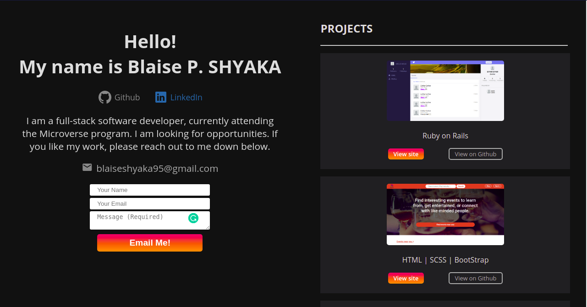

# blaiseshyaka95

blaiseshyaka95 is my portfolio project. I showcase projects that I am proud of here. It is built with HTML, CSS, and JS.

## Built With

- HTML
- CSS
- JS

## Live Demo

[View live version](https://rawcdn.githack.com/Blaise-Shyaka/blaiseshyaka95/homepage/index.html)

## Setup

- Git clone [this repository](https://github.com/Blaise-Shyaka/FindEvent.git)
- Open `index.html` with your default browser.

## Authors

👤 **Blaise Pascal Shyaka**

- Github: [@Blaise-Shyaka](https://github.com/Blaise-Shyaka)
- Twitter: [@blaiseshyaka95](https://twitter.com/blaiseshyaka95)
- Linkedin: [linkedin](https://www.linkedin.com/in/blaise-pascal-shyaka)

## 🤝 Contributing

Contributions, issues and feature requests are welcome!

Feel free to check the [issues page](https://github.com/Blaise-Shyaka/blaiseshyaka95/issues/).

## Show your support

Give a ⭐️ if you like this project!

## Acknowledgments

- The Cupids team for review and suggestions